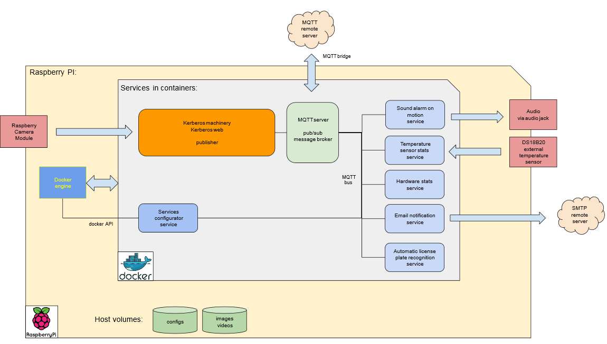

**Intro**

This project is an attempt at running Kerberos-io (https://github.com/kerberos-io/) instance in a docker container on Raspberry Pi 2/3 hardware and use the native Raspberry Camera Module.

The kerberos container is managed by the docker-compose and runs along with other "helper" apps in containers (like simple webhooks listener).

Enjoy! :-)
 

**Installation**

* Grab the newest Raspbian (Stretch Lite) from https://www.raspberrypi.org/downloads/ , install it on a SD card (8GB at least).
* Enable the SSH (raspi-config -> interfacing -> SSH)
* Enable the camera module support (raspi-config -> interfacing -> camera)
* Set video memory do 256MB (raspi-config -> advanced -> memory split)
* (optional) Enable WiFi networking (raspi-config)
* Clone this repo (git clone REPO_URL)
* Rename the file **.env.template** to **.env** then edit it and update with your configuration (like SMTP host/password etc.)
* Run "**bash ./install.sh**" inside the repo directory you've just cloned.

* See the installation page at http://_YOUR_RASPBERRY_PI_ADDRESS_
* The video stream is at http://_YOUR_RASPBERRY_PI_ADDRESS_:8889   
* The docker containers statistics are at http://_YOUR_RASPBERRY_PI_ADDRESS_:82   

The application will be automatically restarted on reboot, unless you explicitely stop it (see instructions below).


**Stop the system**
`````
docker-compose stop 
`````

**Start up the system again**
`````
docker-compose up -d 
`````

The containers will automatically restart on reboot/failure unless explicitly stopped 


**Show containers output/logs (last 10 lines, then follow the output)**
`````
docker-compose logs -f --tail=10
`````

**Show kerberos Web Nginx logs**
`````
docker-compose exec kerberos-deb bash -c "tail -f /var/log/nginx/*"
`````

**Show Laravel logs**
`````
docker-compose exec kerberos-deb bash -c "tail -f /var/www/web/storage/logs/laravel.log"
`````

**Show webhook event listener logs**
`````
docker-compose logs -f | grep webhook
`````

**Run bash inside kerberos container**
`````
docker-compose exec kerberos-deb bash
`````

