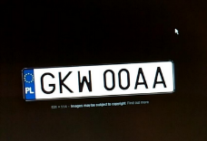

**Service: automatic license plate recognition**

This service uses openALPR (automatic license plate recognition) to analyze images and find car registration numbers.

 
**Overview**

* Subscribes to the MQTT topic **kerberos/machinery/detection/motion**
* Topic payloads are picked up by topic collector and saved in local queue
* Saved topics are picked up from the local queue by the queue processor 
* Queue processor uses openALPR to analyze an image and find possible plate numbers
* Upon successfull detection service publishes MQTT topic with the list of guessed numbers

**Subscribed to MQTT topics**

* **kerberos/machinery/detection/motion** - this topic triggers alpr to find license plates in an image  

**Published MQTT topics**

* **alpr/detection** - with (best guess) car registration plate numbers in the JSON payload  

**Shared files**

* /data/kerberos/capture - captured media  

**Configuration files**

* /.env

