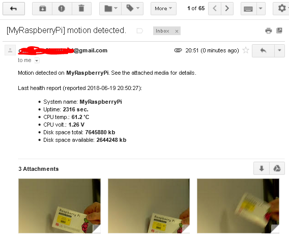

**Service: alert email sender**

Simple PHP implementation to send email with images upon motion detection.

**Email example**



**Overview**
* Topic payloads are picked up by topic collector and saved in a directory (simple file-based queue)
* Saved topics are picked up from the local queue by the queue processor which creates emails with alerts and sends via external SMTP server.
* Helper scripts:
  * **Topics collector** - subscribes to MQTT topics to collect payloads (motion detections and health report) and save them in files
  * **Topic queue processor** - scans topic queue directory, aggregates multiple motion detection payloads, creates email and puts email data into email queue    
  * **Email queue processor** - scans email queue directory for email data, sends emails via SMTP server

**Subscribed to MQTT topics**

* **kerberos/motiondetected**  
* **healthcheck/report**  

**Published MQTT topics**

* **notification/email/sent** - published when alert email is sent 

**Own shared resources**

* /data/email-notification/topic-queue - queue of the topics collected to be processesed by the topic processor   
* /data/email-notification/email-queue - queue of emails to be sent.    

**Used shared resources**

* /data/kerberos/capture - media from the kerberos service

**Configuration files**

* /configs/services.conf

**Sending an email with the email queue processor**

To send an email with the email queue processor simply create new *.json file in the email queue directory
with data in the following JSON format:

`````
    {
        "recipients":[
            "RECIPIENT EMAIL 1",
            "RECIPIENT EMAIL 2"
        ],
        "subject":"MY SUBJECT",
        "htmlBody":"MY HTML BODY"
        "attachments":[
            {
                "filePath":"FILE PATH 1"
            },
            {
                "filePath":"FILE PATH 2"
            }
        ]
    }
`````

The email queue processor will pick up the file, process it, create email with the data provided.

The file is removed after the email is successfully sent via the SMTP server.  