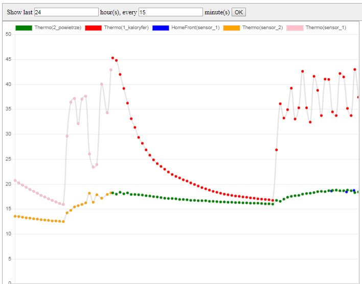

**Service: event historian**

This service saves all local and remove MQTT events in local sqlite database 

**Configuration files**

* See `/configs/services.conf` 

**Service configuration**

* `KD_HISTORIAN_ENABLED=0` to disable service 
* `KD_HISTORIAN_ENABLED=1` to enable service

**User interface**

* Go to `http://_YOUR_RASPBERRY_PI_ADDRESS_/historian`

**Own shared resources**

* /data/historian/mqtt-history.sqlite   

**Example of historian charts**

