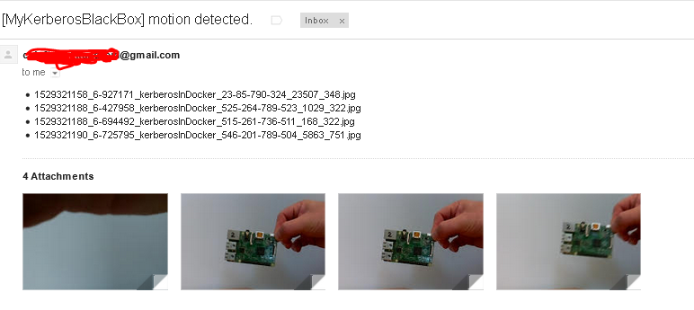

**Service: alert email sender**

Simple PHP implementataion to send email with images upon motion detection.

**Overview**
* Subscribes to the MQTT topic **kerberos/machinery/detection/motion**
* Topics are picked up by topic collector and saved in local queue
* Saved topics are picked up from the local queue by the queue processor which creates emails with alerts and sends via externam SMTP server.

**Subscribed to MQTT topics**

* kerberos/machinery/detection/motion  

**Shared files**

* /data/kerberos/capture - captured media  

**Configuration files**

* /.env

