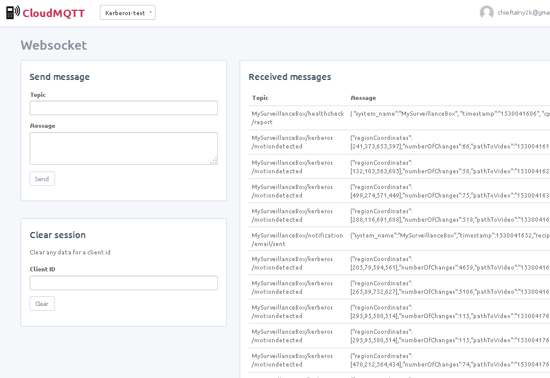

**Service: MQTT queue server/broker**

This core service provides the local MQTT server to all services

**Overview**

* Avaialble for all local services at **mqtt-server:1883**
* All services must connect to this server to publish/subscribe to topics
* The server may act as a bridge and send/receive topics to/from external mqtt server and forward them to local/remote topics (useful for remote stats and checks).  

**Configuration files**

* See the **/configs/services.conf** file for details and topic bridge params (see http://www.steves-internet-guide.com/mosquitto-bridge-configuration/)

**MQTT Bridge**

* Incoming topics have the **remote/** prefix attached
* Outgoing topics have the **KD_SYSTEM_NAME/ (see services.conf)** prefix attached

**Example of working bridge publishing topics to remote server**

